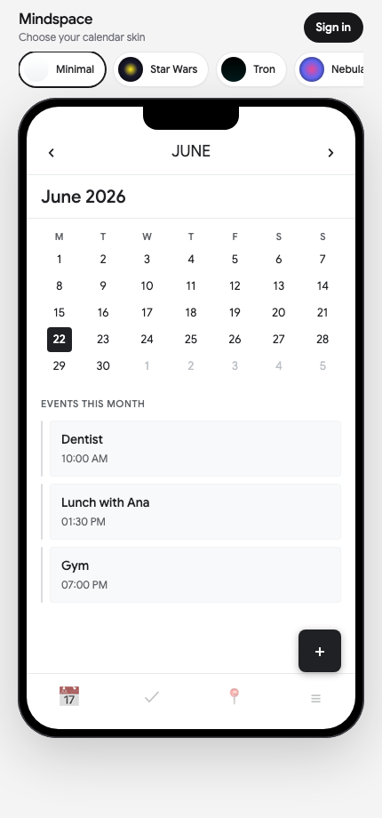
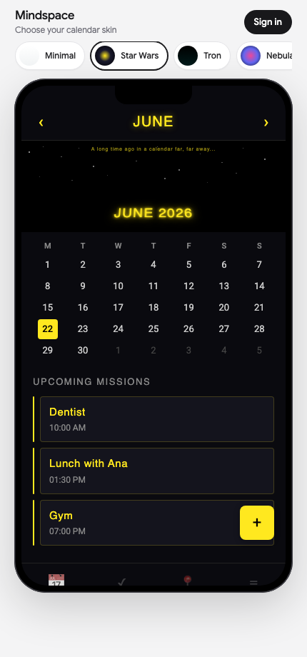
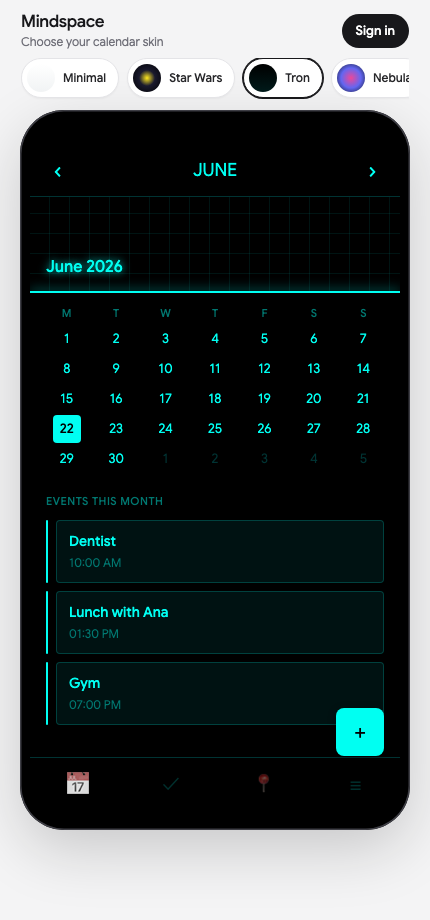
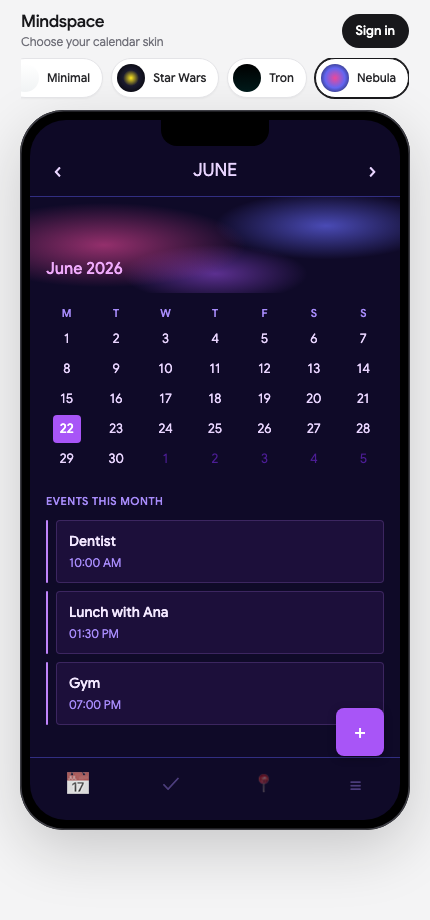
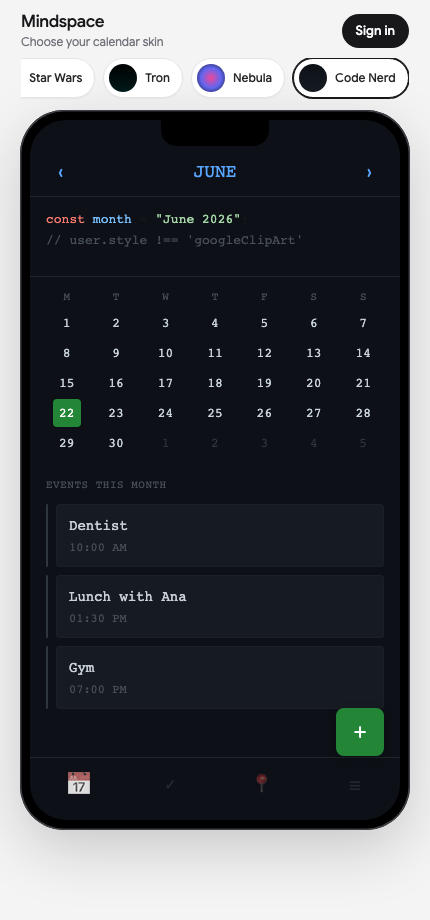

# Mindspace Calendar

**Your calendar. Your aesthetic.** An open-source proposal showing what Google Calendar mobile could look like if users chose their own visual identity — instead of inheriting clip art, kites, and a UI frozen in time.

[](https://custom-mindspace-calendar.vercel.app)
[](LICENSE)

→ **Try it now:** [custom-mindspace-calendar.vercel.app](https://custom-mindspace-calendar.vercel.app)

---

## Five skins. Same Google Calendar data.

Pick a theme, sign in, browse months — your real events, reimagined.

| Minimal | Star Wars | Tron |
|:---:|:---:|:---:|
|  |  |  |

| Nebula | Code Nerd |
|:---:|:---:|
|  |  |

*Clean white. Space opera. Neon grid. Cosmic gradients. Terminal dark. Zero elementary-school energy.*

---

## The problem Google won't let you fix

Google Calendar on mobile assigns a decorative month banner — kites, blobs, seasonal clip art — with **no way to opt out or choose your own look**. The scheduling works. The visual identity does not belong to you.

This project is a working counter-proposal: **swappable calendar skins** powered by the same Google Calendar API, rendered in a phone-sized interface that feels like a product, not a wireframe.

---

## A fossil with fresh paint

Google Calendar's visual history has three distinct eras — and the experience users live with today is a stack of decisions from almost a decade ago:

### 2017 — The last real redesign (9 years ago)

In October **2017**, Google shipped the last major structural redesign of Calendar for desktop: **Material Design 2**. Rounded grid cells, the floating **+** button, *Product Sans* typography. The skeleton most people still navigate today was born here.

### 2021 — Material You, same bones (5 years ago)

In **2021**, Google applied **Material You (Material Design 3)** — softer pastels, rounder buttons, official dark mode. A refresh, not a rebuild. The layout, icons, and interaction model stayed rooted in 2017.

### 2014 — OAuth, still waiting in the lobby

Meanwhile, the grey OAuth consent screen — the gate between your app and a user's calendar — **hasn't meaningfully moved since ~2014**. Google separated the aesthetics of its products from the aesthetics of its security layer. The calendar got a 2021 coat of paint; the auth pipeline did not.

> *It's ironic that in the era of generative AI and edge computing, developers are still forced to manually copy-paste text strings into environments, praying that an opaque infrastructure from 2014 decides to recognize them. If AI can generate entire applications in seconds, Google's auth pipeline shouldn't be a black box that requires manual prophecy to debug. We need smarter tooling to bridge the cloud console with runtime environments — because this static, manual flow belongs in a museum.*

Mindspace Calendar exists at that intersection: **a modern, user-chosen interface** running on **2014-era OAuth plumbing**. The contrast is the point.

---

## Live demo

1. Pick a skin in the theme bar.
2. Use **‹ ›** to browse past and future months.
3. Tap **Sign in** to load your real Google Calendar events (read-only).
4. Switch themes and watch the same schedule transform.

### First users (sign-in)

**Skins work for everyone — no list, no sign-in.**

Sign-in is optional and limited while the demo is in progress (Google OAuth Testing mode, ~100 spots).

**For visitors:**
1. Enter Gmail in **Join list** on the demo
2. Confirm the pre-filled GitHub issue (one tap)
3. Maintainer adds your Gmail in Google Cloud → Test users
4. **Sign in** on the demo — usually within 24h

**For you (maintainer):** watch [early-access issues](https://github.com/eliospina/custom-mindspace-calendar/issues?q=label%3Aearly-access), add Gmail in [Test users](https://console.cloud.google.com/auth/audience?project=custom-mindspace-calendar), close issue.

Optional: set `BETA_ACCESS_URL` in Vercel to a Google Group join link.

---

## Themes

| Theme | Vibe |
|-------|------|
| **Minimal** | Clean white — no illustrations |
| **Star Wars** | Starfield, yellow crawl typography |
| **Tron** | Black canvas + cyan neon grid |
| **Nebula** | Cosmic purple / pink gradients |
| **Code Nerd** | Terminal / GitHub dark |

---

## For developers

Vanilla HTML, CSS, and JavaScript — no bundler. Tailwind on the outer shell only; the phone calendar is inline-styled per theme.

```
├── index.html              # App shell + phone frame
├── app.js                  # Renderer, OAuth, month navigation
├── styles.js               # Theme definitions
├── config.example.js       # Google credentials template
├── scripts/generate-config.mjs
└── vercel.json
```

### Run locally

```bash
cp config.example.js config.js
# Add your Google Cloud credentials
npx serve . -l 3000
```

### Google Cloud setup

1. Enable **Google Calendar API** in [Google Cloud Console](https://console.cloud.google.com/).
2. Create an **API key** (restrict to Calendar API + HTTP referrers).
3. Create an **OAuth 2.0 Web Client ID** with authorized origins:
   - `http://localhost:3000`
   - `https://custom-mindspace-calendar.vercel.app`
4. Scope: `calendar.events.readonly` — events only, no write access.

### Fix “Access blocked” (Error 403)

Keep the app in **Testing** mode and add each Gmail under **OAuth consent screen → Test users**. Confirm the Vercel URL is in authorized JavaScript origins and API key referrers. See [Google's testing guide](https://console.cloud.google.com/auth/audience?project=custom-mindspace-calendar).

### Deploy on Vercel

Every push to `main` auto-deploys. Set in the Vercel dashboard:

| Variable | Value |
|----------|-------|
| `GOOGLE_CLIENT_ID` | OAuth Web client ID |
| `GOOGLE_API_KEY` | Restricted API key |
| `BETA_ACCESS_URL` | *(optional)* Google Group join URL for **Request access** button |

---

## Who this is for

- **Google Calendar PMs & designers** — a concrete “what if users could choose?” reference, with screenshots ready to share.
- **Developers** — a minimal, forkable Calendar API + theme-switching demo.
- **Anyone tired of the kite** — you are not alone.

## Disclaimer

Not affiliated with Google, Lucasfilm, Disney, or Tron. Fan-style themes are for demonstration. A personal UX critique packaged as working code — not a Google product.

## License

MIT — see [LICENSE](LICENSE).
