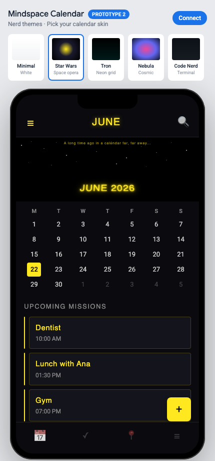

# Mindspace Calendar · Prototype 2

**Open-source UX proposal for Google Calendar mobile** — let users choose how their calendar looks instead of forcing auto-generated month illustrations.

[](https://custom-mindspace-calendar.vercel.app)
[](LICENSE)

## The problem

Google Calendar on mobile assigns a decorative month banner (kites, blobs, clip art) with **no way to opt out or pick your own look**. The calendar works; the visual identity does not belong to the user.

## The proposal

Give people **swappable calendar skins** — same events, same Google Calendar data, different aesthetic. This prototype shows what that could feel like on a phone-sized mockup.

## Live demo

**https://custom-mindspace-calendar.vercel.app**



1. Pick a theme in the carousel above the phone mockup.
2. Use **‹ ›** in the phone header to browse past and future months.
3. Optionally tap **Connect** to load your real Google Calendar events (read-only).
4. Compare how the same month reads in each skin.

### Want to test Connect with your Google account?

Themes work without signing in. **Connect** requires your Gmail on the OAuth allowlist (Testing mode).

- **Quick path:** open an issue on this repo with your Gmail and the maintainer will add you as a test user.
- **Self-serve path (recommended for many testers):** join the beta Google Group *(link coming soon — create `mindspace-beta@googlegroups.com`, add it under OAuth → Test users, then paste the join URL here)*.

Until the group exists, email **ospieli85@gmail.com** or file a [theme/access request issue](https://github.com/eliospina/custom-mindspace-calendar/issues/new/choose).

## Themes

| Theme | Vibe |
|-------|------|
| **Minimal** | Clean white — no illustrations |
| **Star Wars** | Starfield, yellow crawl typography |
| **Tron** | Black canvas + cyan neon grid |
| **Nebula** | Cosmic purple / pink gradients |
| **Code Nerd** | Terminal / GitHub dark |

## Project structure

```
├── index.html          # Landing + phone mockup shell
├── app.js              # Calendar renderer, Google OAuth, style switching
├── styles.js           # Theme definitions (CALENDAR_STYLES)
├── config.example.js   # Google credentials template (copy → config.js)
├── scripts/
│   └── generate-config.mjs   # Vercel build: copies assets → public/
├── vercel.json         # Build command + output directory
└── public/             # Build output (generated, not committed)
```

Vanilla HTML/CSS/JS — no bundler, no framework. Tailwind via CDN for the outer chrome only; the phone calendar is inline-styled per theme.

## Run locally

```bash
cp config.example.js config.js
# Edit config.js with your Google Cloud credentials
npx serve . -l 3000
```

Open `http://localhost:3000`. OAuth requires HTTP — opening `index.html` as a file will not work.

### Google Cloud setup

1. Create a project in [Google Cloud Console](https://console.cloud.google.com/).
2. Enable **Google Calendar API**.
3. Create credentials:
   - **API key** — restrict to Calendar API + your HTTP referrers.
   - **OAuth 2.0 Client ID** (Web) — add authorized JavaScript origins:
     - `http://localhost:3000` (or your local port)
     - `https://your-production-domain.vercel.app`
4. Paste both values into `config.js`.

Scope used: `calendar.events.readonly` — events only, no write access.

### Connect from your phone (fix “Access blocked” / Error 403)

Google blocks sign-in when the OAuth app is in **Testing** mode and your Gmail is not on the allowlist.

1. Open [Google Cloud Console → OAuth consent screen](https://console.cloud.google.com/apis/credentials/consent).
2. Select the **same project** as your OAuth Client ID.
3. Under **Test users**, click **Add users** and add every Gmail that should connect (e.g. `ospieli85@gmail.com`).
4. Save, wait ~1 minute, then retry **Connect** on your phone.

Also confirm **Credentials → your OAuth 2.0 Client ID (Web)** includes this origin:

```
https://custom-mindspace-calendar.vercel.app
```

And your **API key** HTTP referrers include the same URL (or `https://*.vercel.app/*` for preview deploys).

> **Note:** You do **not** need Google’s full app verification for a personal demo — Testing mode + test users is enough for up to 100 accounts.

### Let testers join without adding emails one by one

Google has **no public API** to auto-add OAuth test users. The closest workflow:

1. Create a [Google Group](https://groups.google.com) (e.g. `mindspace-beta@googlegroups.com`).
2. In **OAuth consent screen → Test users**, add the **group email** (not just individuals).
3. Enable **“Anyone can ask to join”** or share a join link on your README / demo page.
4. Approve join requests — approved members can use **Connect** immediately.

Limit: **100 users total** in Testing mode (individuals + group members count toward the cap).

For open public access without an allowlist, the app must be **In production** and pass Google’s OAuth verification (privacy policy, scope review — often weeks).

## Deploy on Vercel

The project is linked to GitHub — **every push to `main` triggers a production deploy** on Vercel.

```bash
vercel
```

Set environment variables in the Vercel dashboard:

| Variable | Value |
|----------|-------|
| `GOOGLE_CLIENT_ID` | OAuth Web client ID |
| `GOOGLE_API_KEY` | Restricted API key |

The build script writes `public/config.js` from those vars and copies static assets into `public/` for deployment.

## Who this is for

- **Google Calendar PMs / designers** — a concrete “what if users could choose?” reference.
- **Developers** — a minimal forkable demo of Calendar API + theme switching.
- **Anyone annoyed by the kite** — you are not alone.

## Disclaimer

Not affiliated with Google, Lucasfilm, Disney, or Tron. Fan-style themes are for demonstration only. This is a personal UX critique packaged as working code, not a Google product.

## License

MIT — see [LICENSE](LICENSE).
